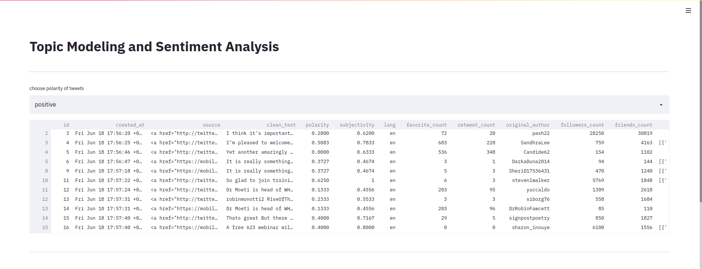
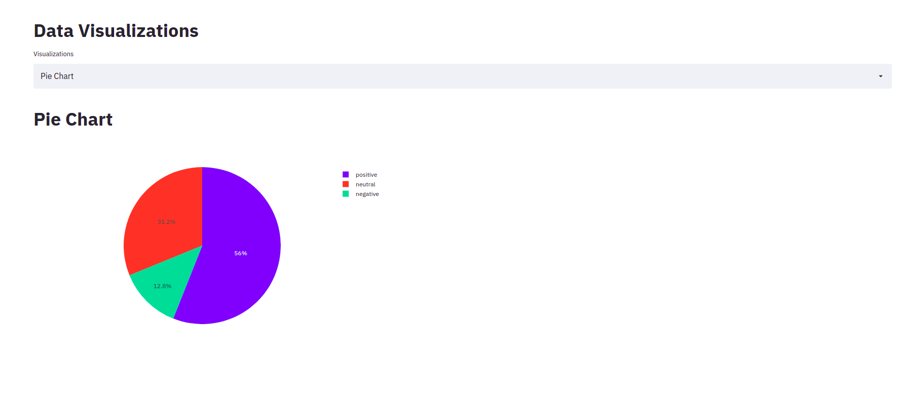

# [10 Academy](https://www.10academy.org/)

> Task: Build a dashboard using streamlit, Flask or any other platform.
## Dashboards Using Streamlit
__Streamlit__ is an open-source Python library that makes it easy to create and share beautiful, custom web apps for machine learning and data science projects 
### Snippets from the dashboard  can be shown below

### Reference
* [Streamlit documentation](https://docs.streamlit.io/en/stable/)
* [towardsdatascience](https://towardsdatascience.com/tagged/streamlit)
