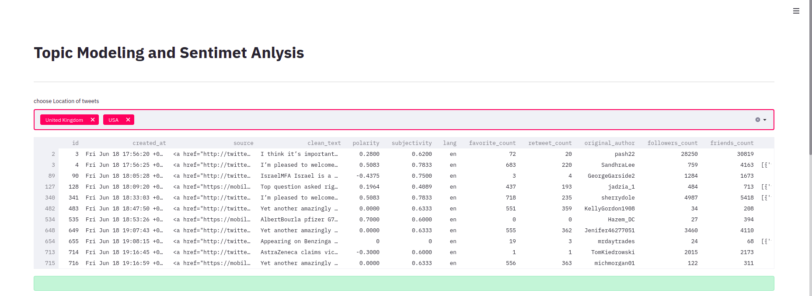
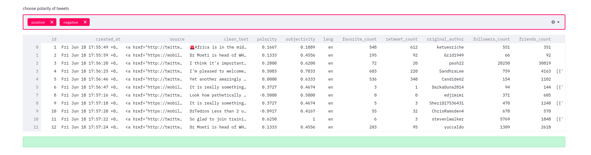
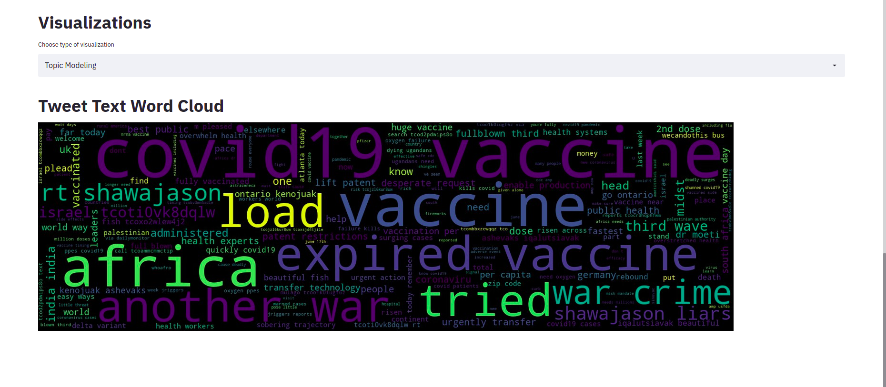
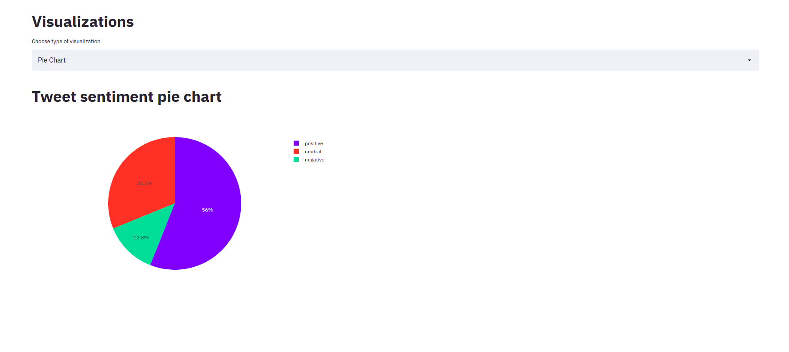
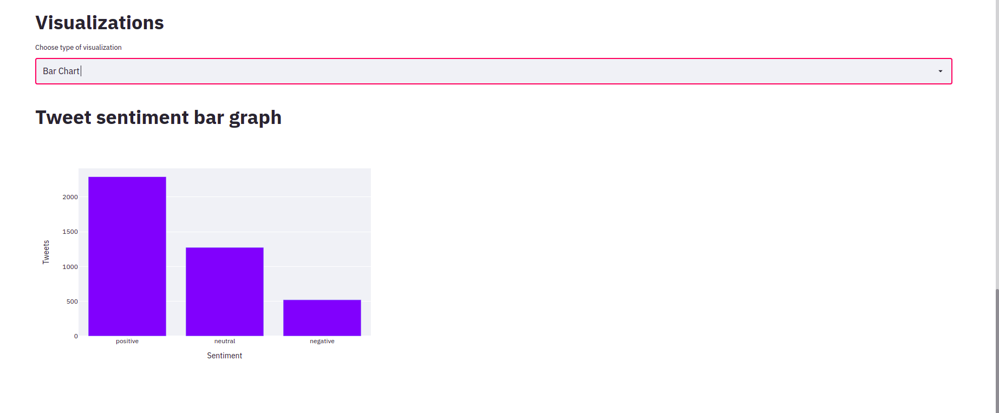

# [10 Academy](https://www.10academy.org/)

> Task: Build a dashboard using streamlit, Flask or any other platform.
## Dashboards Using Streamlit
__Streamlit__ is an open-source Python library that makes it easy to create and share beautiful, custom web apps for machine learning and data science projects

### About the files
* [insert_data.py](https://github.com/Luel-Hagos/10Academy-Week0-Day5/blob/main/insert_data.py) contains the oprations on the database(like inserting data from csv file to database).
* [processed_tweet_data.csv](https://github.com/Luel-Hagos/10Academy-Week0-Day5/blob/main/processed_tweet_data.csv) is the csv file that is inserted to the databse.
* [sql_schema.sql](https://github.com/Luel-Hagos/10Academy-Week0-Day5/blob/main/sql_schema.sql) is the schema.
* [streamlit_dashboard.py](https://github.com/Luel-Hagos/10Academy-Week0-Day5/blob/main/streamlit_dashboard.py) is the dashboard. it contains opertions need to display on the streamlit.
* [requirements.txt](https://github.com/Luel-Hagos/10Academy-Week0-Day5/blob/main/requirements.txt) is the requirements file.

### Snippets from the dashboard  can be shown below.

### Reference
* [Streamlit documentation](https://docs.streamlit.io/en/stable/)
* [towardsdatascience](https://towardsdatascience.com/tagged/streamlit)
